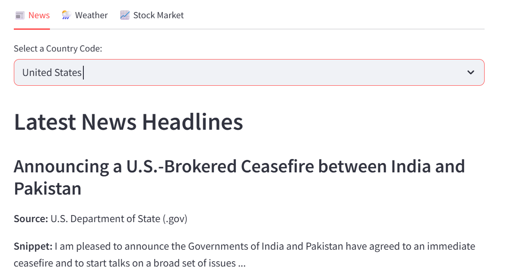
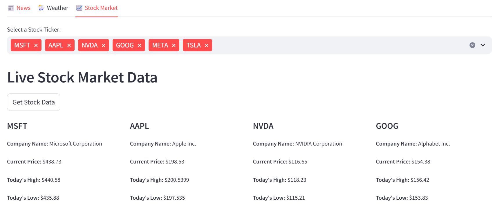

# 🏆 Stock Market Dashboard

A **Streamlit-powered web application** that fetches **real-time stock market data** from Yahoo Finance, displaying **news, stock prices, and market insights** in a structured format.

## ✨ Features
- **Live stock price updates** for selected tickers
- **Multi-select ticker search** for efficient stock filtering
- **Formatted grid layout** to view multiple stocks at once
- **Caching support** to reduce redundant API calls
- **Interactive Streamlit interface** with dynamic filtering

## 🛠️ Installation
### 1️⃣ Clone the Repository
```bash
git clone https://github.com/your-username/your-repo.git
cd your-repo

### create virtual env and install dependencies

python -m venv venv
source venv/Scripts/activate
pip install -r requirements.txt

## Run streamlit app from root of the project
streamlit run src/main_streamlit.py

#UI image

