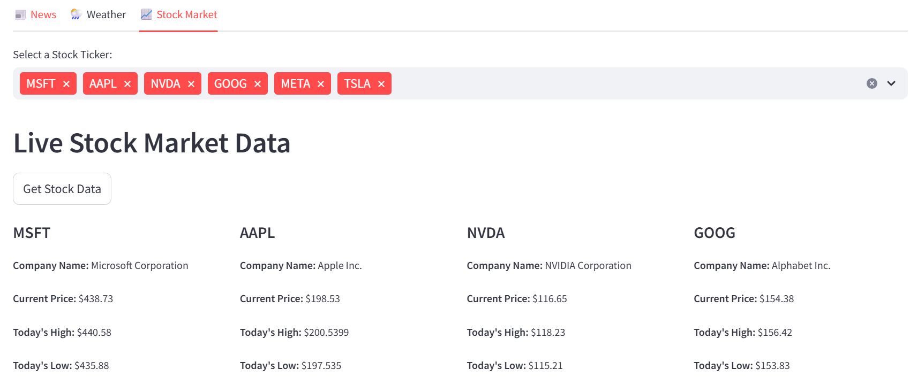
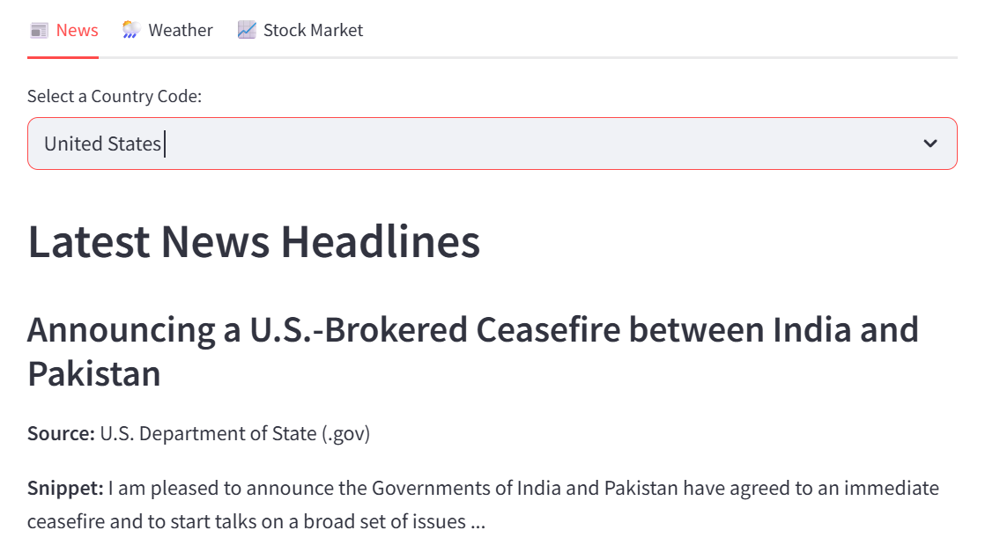

# 🏆 Quickref Dashboard for Stocks, News, etc (future adds)

A **Streamlit-powered web application** that fetches 
    **real-time stock market data** from Yahoo Finance, displaying **stock prices, and market insights** in a structured format.
    **real-time NEWS** from Real-time-news-data, displaying **news by country** in a structured format. 

## ✨ Features
- **News update with 24 hour cache** for selected tickers
- **Live stock price updates** for selected tickers
- **Multi-select ticker search** for efficient stock filtering
- **Formatted grid layout** to view multiple stocks at once
- **Caching support** to reduce redundant API calls
- **Interactive Streamlit interface** with dynamic filtering

## 🛠️ Installation
### 1️ Clone the Repository
```bash
git clone https://github.com/iduryodhanrao/my-quick-tools.git
cd my-quick-tools
```

### 2 Create virtual env and install dependencies
```bash
python -m venv venv
source venv/Scripts/activate
pip install -r requirements.txt
```
## Run streamlit app from root of the project
```bash
streamlit run src/main_streamlit.py
```
## UI image
### Stock
 
### News 
